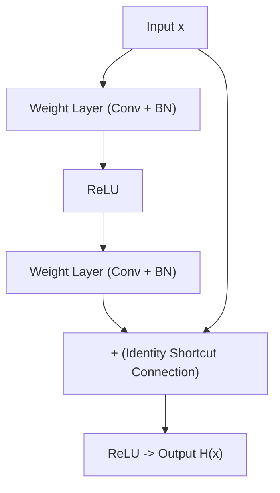

# Residual Networks (ResNets) & Deep Residual Learning

Deep Neural Networks historically suffered from the **degradation problem**: as network depth increased, accuracy saturated and degraded rapidly due to vanishing/exploding gradients. **Residual Networks (ResNets)** revolutionized deep learning by introducing **identity shortcut (skip) connections**.

---

## 📁 Module Structure

```text
residual_networks/
├── custom_resnet.ipynb   # Jupyter Notebook for custom ResNet block construction
└── README.md             # Theoretical mechanics & architectural breakdown of ResNets
```

---

## 🧠 Theoretical Foundations

### 1. The Residual Block Formulation
Instead of hoping stacked layers fit a desired underlying mapping $\mathcal{H}(x)$, residual learning explicitly lets layers approximate a residual mapping:

$$\mathcal{F}(x) := \mathcal{H}(x) - x$$

The original mapping is recast into:

$$\mathcal{H}(x) = \mathcal{F}(x) + x$$



---

### 2. Why Skip Connections Solve Gradient Vanishing
During backpropagation, the gradient of the loss $\mathcal{E}$ with respect to input $x$ is computed via the chain rule:

$$\frac{\partial \mathcal{E}}{\partial x} = \frac{\partial \mathcal{E}}{\partial \mathcal{H}} \left( \frac{\partial \mathcal{F}}{\partial x} + 1 \right)$$

The $+1$ term guarantees that gradients can flow directly backward through the identity shortcut connection to earlier layers without diminishing—even if the learned residual weights $\frac{\partial \mathcal{F}}{\partial x}$ approach zero.

---

### 3. Basic Residual Block Implementation (PyTorch)

```python
import torch
import torch.nn as nn

class ResidualBlock(nn.Module):
    def __init__(self, in_channels, out_channels, stride=1):
        super().__init__()
        self.conv1 = nn.Conv2d(in_channels, out_channels, kernel_size=3, stride=stride, padding=1, bias=False)
        self.bn1 = nn.BatchNorm2d(out_channels)
        self.relu = nn.ReLU(inplace=True)
        self.conv2 = nn.Conv2d(out_channels, out_channels, kernel_size=3, stride=1, padding=1, bias=False)
        self.bn2 = nn.BatchNorm2d(out_channels)
        
        self.shortcut = nn.Sequential()
        if stride != 1 or in_channels != out_channels:
            self.shortcut = nn.Sequential(
                nn.Conv2d(in_channels, out_channels, kernel_size=1, stride=stride, bias=False),
                nn.BatchNorm2d(out_channels)
            )

    def forward(self, x):
        residual = x
        out = self.relu(self.bn1(self.conv1(x)))
        out = self.bn2(self.conv2(out))
        out += self.shortcut(residual)
        out = self.relu(out)
        return out
```

---

## 🚀 How to Run

Open the notebook in Jupyter:

```bash
jupyter notebook 09_computer_vision/residual_networks/custom_resnet.ipynb
```
