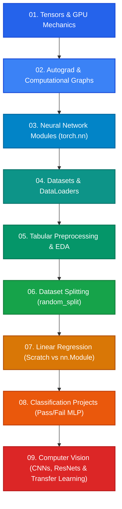

# 🚀 PyTorch Deep Learning Journey

<div align="center">

[](https://www.python.org/)
[](https://pytorch.org/)
[](https://pytorch.org/vision/stable/index.html)
[](https://jupyter.org/)
[](https://pandas.pydata.org/)
[](https://scikit-learn.org/)
[](https://opensource.org/licenses/MIT)

**A structured, comprehensive journey through Deep Learning with PyTorch—progressing from low-level Tensor operations and Autograd mechanics to custom Convolutional Neural Networks (CNNs), Pretrained Transfer Learning, and Residual Networks (ResNets).**

[Explore Roadmap](#-learning-roadmap) • [Project Highlights](#-featured-projects) • [Directory Structure](#-repository-structure) • [Getting Started](#-getting-started)

</div>

---

## 🗺️ Learning Roadmap



---

## 📂 Repository Structure

The codebase is organized into sequential, modular chapters with dedicated documentation for each topic:

| Chapter | Module | Description | Key Topics |
| :---: | :--- | :--- | :--- |
| **01** | [`01_tensors`](./01_tensors/) | Tensor Basics & CUDA Acceleration | Tensors, shapes, slicing, in-place math, `@` operator, GPU migration |
| **02** | [`02_autograd`](./02_autograd/) | Automatic Differentiation Engine | Computation DAGs, `requires_grad`, `.backward()`, gradient accumulation, `zero_()` |
| **03** | [`03_neural_networks`](./03_neural_networks/) | Deep Learning Layers & Modules | `nn.Module`, `nn.Linear`, `nn.Sigmoid`, `nn.ReLU`, `MSELoss`, `CrossEntropyLoss` |
| **04** | [`04_datasets_and_dataloaders`](./04_datasets_and_dataloaders/) | Data Ingestion Pipelines | `TensorDataset`, `DataLoader`, batching, multiprocessing, custom `Dataset` subclassing |
| **05** | [`05_pandas_for_ml`](./05_pandas_for_ml/) | Tabular Data Preprocessing & EDA | Pandas telemetry inspection, missing value imputation, distribution histograms, correlation |
| **06** | [`06_train_test_split`](./06_train_test_split/) | Dataset Partitioning | PyTorch `random_split`, train/test splits, separate DataLoader instances |
| **07** | [`07_linear_regression`](./07_linear_regression/) | Linear Regression (Scratch & Module) | Manual Autograd SGD vs `nn.Module` + `Adam`, saving & loading weights (`state_dict`) |
| **08** | [`08_classification_projects`](./08_classification_projects/) | Tabular Classification MLP | Multi-feature student pass/fail prediction, Cross-Entropy optimization, Softmax inference |
| **09** | [`09_computer_vision`](./09_computer_vision/) | Computer Vision & Deep Architectures | Torchvision transforms, CIFAR-10 CNN, Intel Natural Scenes, ResNet18 Transfer Learning |
| **Docs**| [`docs_and_research`](./docs_and_research/) | Research Presentations & Papers | Final Year Project Synopsis on Split Federated Learning (`SplitFed`) |

---

## ⭐ Featured Projects

### 1. 🏞️ [Intel Image Classification: CNN vs Transfer Learning](./09_computer_vision/intel_image_classification/)
- **Objective**: Multi-class natural scene classification across 6 categories: `buildings`, `forest`, `glacier`, `mountain`, `sea`, and `street`.
- **Architectures**:
  - **Custom 4-Stage CNN**: Convolutions, Batch Normalization, Max Pooling, Dropout (`p=0.5`), and Cross-Entropy Loss with **Label Smoothing** (`0.1`).
  - **Transfer Learning (ResNet-18)**: Pretrained ImageNet weights with fine-tuned `layer4` residual blocks and custom classification head.
- **Evaluation**: Full confusion matrix heatmaps, test loss progression, and granular per-class accuracy benchmarks.

---

### 2. 🚗 [CIFAR-10 Classification with Enhanced CNN](./09_computer_vision/cifar10_classification/)
- **Objective**: Classifying 60,000 $32 \times 32$ images across 10 distinct object classes.
- **Key Techniques**: Data augmentation (RandomCrop, RandomHorizontalFlip, channel normalization), 5-layer CNN feature extractor with `BatchNorm2d`, 4-layer MLP classifier with `Dropout(0.5)`.
- **Results**: **82.54% Test Accuracy** on 10,000 unseen test samples with single-image inference pipeline.

---

### 3. 🎓 [Student Pass/Fail Classifier](./08_classification_projects/pass_fail_classifier/)
- **Objective**: Binary classification predicting student academic success based on study hours, attendance, historical grades, and sleep.
- **Architecture**: 3-layer Multi-Layer Perceptron (MLP) with ReLU non-linearities and Adam optimizer.

---

### 4. 📈 [Linear Regression: Pure Autograd vs `torch.nn`](./07_linear_regression/)
- **Objective**: Understanding the underlying mechanics of deep learning frameworks by implementing linear regression first via raw calculus derivatives and gradient updates in `torch.no_grad()`, then refactoring to idiomatic `torch.nn.Module`, `optim.Adam`, and `state_dict` persistence.

---

## 🛠️ Getting Started

### 1. Clone the Repository
```bash
git clone https://github.com/GHSHamad312/Pytorch-Projects.git
cd Pytorch-Projects
```

### 2. Set Up a Virtual Environment
```bash
# Create virtual environment
python -m venv venv

# Activate on Windows
venv\Scripts\activate

# Activate on Linux/macOS
source venv/bin/activate
```

### 3. Install Dependencies
```bash
pip install -r requirements.txt
```

---

## 💻 Running the Code

### Running Python Scripts
```bash
# Tensor basics
python 01_tensors/tensor_basics.py

# Gradient computation
python 02_autograd/calculating_gradients.py

# Neural network layers
python 03_neural_networks/simple_linear_layer.py

# Tabular classification
python 08_classification_projects/pass_fail_classifier/classifier.py
```

### Launching Jupyter Notebooks
```bash
jupyter notebook
```
Navigate to:
- `09_computer_vision/cifar10_classification/main.ipynb`
- `09_computer_vision/intel_image_classification/main.ipynb`
- `09_computer_vision/intel_image_classification/transfer_learning.ipynb`
- `09_computer_vision/residual_networks/custom_resnet.ipynb`

---

## 🧠 Key Skills & Concepts Mastered

- **PyTorch Core**: Tensors, Shapes, In-place operations, Broadcasting, Device transfer (CPU $\leftrightarrow$ GPU).
- **Autograd Engine**: Dynamic Computation Graphs (DAG), Backpropagation, Gradient accumulation & zeroing.
- **Model Construction**: `nn.Module`, `nn.Sequential`, Custom forward passes, Parameter inspection.
- **Computer Vision**: Convolutional layers (`Conv2d`), Batch Normalization (`BatchNorm2d`), Max Pooling (`MaxPool2d`), Dropout (`Dropout2d`/`Dropout`).
- **Transfer Learning**: Pretrained backbones (ResNet-18), Layer freezing, Deep feature fine-tuning.
- **Data Engineering**: Custom `Dataset` subclassing, `DataLoader` mini-batching, `torchvision.transforms` data augmentation pipelines.
- **Optimization & Regularization**: SGD, Adam, Learning rates, Weight decay, Label smoothing, Dropout.
- **Evaluation & Diagnostics**: Multi-class Confusion Matrices (`ConfusionMatrixDisplay`), Per-class accuracy, Loss curves.

---

## 📜 License

This repository is licensed under the [MIT License](LICENSE).